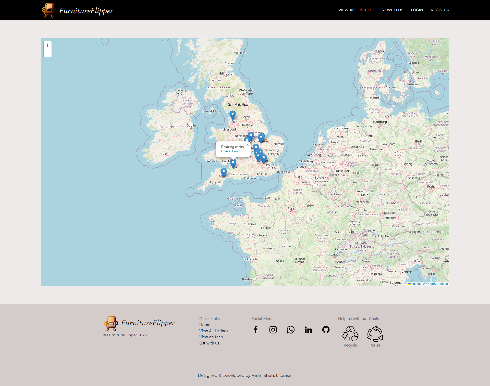

      
    <h2>FurnitureFlipper</h2>

## 🌟 Description

FurnitureFlipper is a WebApp for listing your used furniture for buy or sell. Users can easily create & manage a listing, mark it on a map for other users to view & inquire about by asking questions or by contacting the lister directly. Additionally, they can view other users' listings through search, feed or on a Map to view the ones nearby.  

Tldr;
It's the yellowpages of listing your used furniture for buying & selling but with a Map & Interactice UI.

## 🌱 Purpose

The primary purpose of this project was for training and skill practice while also serving as a demonstration of my existing skills.

## 🌐 Technologies

- NodeJS
- ExpressJS
- MongoDB
- JavaScript
- EJS
- HTML/CSS
- UIKit CSS

## 🧮 Features

- View used furniture listings posted by other users.
- Navigate on a map to view listings near you.
- Search for relevant listings.
- Register or Login to the platform.
- Users can view contact details of used furniture they're interested.
- Users can ask questions for the lister to answer.
- Users can create their own furniture listings & manage it.
- Upload pictures of their used furniture.
- Allow location access to mark the approximate location of the listing on the map or mark it yourself.

## 🖥️ Screenshots

- ### Landing Page

  > Landing page images will shuffle

  ## </img>

  </img>

- ### View all Listings

  ## </img>

  <!-- ## </img> -->

- ### Map View

  ## </img>

- ### Search Page

  ## </img>

- ### Register

  > Register/Login page images will shuffle just like the landing page

  ## </img>

- ### Login

  ## </img>

- ### New Listing

  > Only a logged in User can view this page

  ## </img>

- ### Edit Listing

  > Only a logged in User who authored this listing can view this page

  ## </img>

- ### View Listing (Visitor)

  > Show page as a Visitor

  ## </img>

- ### View Listing (User)

  > Only an User can ask Questions for the listing, or delete Questions they authored.

  ## </img>

  > Only an User can view Contact Information, visitors will be redirected to Login on button click.

  ## </img>

- ### View Listing (Author)

  > Only an Author of the listing can perform Edit/Delete operations. (even with 3rd party post requests).

  ## </img>

  > An Author can't ask Questions on his own listing & only the Author can Answer those asked by other users. (even with 3rd party post requests).

  ## </img>

  > An Author can view his Listings.

  ## </img>

- ### Responsiveness

> Responsive at all display resolutions

</img>
</img>
</img>
</img>
</img>
</img>
 
</img>
</img>
</img>
</img>

<!-- ## Video -->

<!-- video for it -->

## Implementation

- ### 🔐 Authentication & Authorization with Passport

  This project uses the Passport authentication middleware to facilitate user registration and login. In addition to authentication, Passport is also used to generate a session cookie and serialize/deserialize the user for backend authorization of operations such as editing and deleting authored listings, as well as performing other actions on questions.

- ### 📝 CRUD operations with RESTful

  - #### 📜 Listings

    - Anyone can perform Read Operations
    - A logged in user can Create a Listing
    - The Author of the Listing can perform Update & Delete operations

  - #### ❓ Questions

    - Anyone can perform Read Operations on both Questions & Answers
    - A Logged in user can create a Question
    - The Author of the Question can perform a Delete operation.
    - The Author of the Lisitng can create an Answer for the Questions.

- ### 🗃️ Database

  This project uses Mongoose to execute MongoDB queries

  - #### 👤 UserSchema

  | Field Name   | Data Type | Required | Description                                                                                        |
  | ------------ | --------- | -------- | -------------------------------------------------------------------------------------------------- |
  | email        | string    | True     | The user's email address.                                                                          |
  | username     | string    | True     | The username is set to use the email.                                                              |
  | firstName    | string    | True     | The user's first name.                                                                             |
  | lastName     | string    | True     | The user's last name.                                                                              |
  | phoneNumber  | number    | False    | The user's phone number.                                                                           |
  | creationDate | string    | True     | The date and time the user's account was created. Formatted as a string (e.g. "YYYY-MM-DD HH:MM"). |

  - #### 🪑 FurnitureSchema

  | Field Name | Data Type                  | Required | Description                                                                                                     |
  | ---------- | -------------------------- | -------- | --------------------------------------------------------------------------------------------------------------- |
  | title      | string                     | True     | The title of the furniture item.                                                                                |
  | price      | number                     | True     | The price of the furniture item.                                                                                |
  | desc       | string                     | False    | The description of the furniture item.                                                                          |
  | lat        | number                     | True     | The latitude coordinate of the furniture item's location.                                                       |
  | lng        | number                     | True     | The longitude coordinate of the furniture item's location.                                                      |
  | imageurl   | object array               | True     | An object array containing the URLs and filename(s) of the image associated with the item.                      |
  | timestamp  | string                     | True     | The date and time the furniture item was added to the system, formatted as a string (e.g. "YYYY-MM-DD HH:MM").. |
  | author     | reference (ObjectId)       | True     | A reference to the `UserSchema` who authored the furniture item.                                                |
  | questions  | reference array (ObjectId) | False    | An array of references to `QuestionsSchema` associated with the furniture item.                                 |

  - #### ❓ QuestionsSchema

  | Field Name | Data Type            | Required | Description                                                                                              |
  | ---------- | -------------------- | -------- | -------------------------------------------------------------------------------------------------------- |
  | ques       | string               | True     | The text of the question.                                                                                |
  | ans        | string               | False    | The text of the answer to the question.                                                                  |
  | author     | reference (ObjectId) | True     | A reference to the `UserSchema` who authored the question.                                               |
  | timestamp  | string               | True     | The date and time the question was added to the system, formatted as a string (e.g. "YYYY-MM-DD HH:MM"). |

- ### 👮 Joi Validations

  - This project leverages the Joi module for schema validations in `UserSchema`, `QuestionsSchema` & `FurnitureSchema` of Data Types, Length & Required properties for incoming data input through post routes of the application or catch invalid post requests with a 3rd party post request.

  - SanitizeHTML package is used as an extension for the Joi Schema to prevent any HTML tags from entering the Database.

- ### 🖼️ Multer middleware

  - Multer middleware is used for handling multipart/form-data for file uploads & file validations like Size, Limit & Mimetypes to only support. (Upto 4 Image files of type JPG/JPEG/PNG each within 4MB).

- ### 🗺️ Leaflet & OpenStreetMaps

  - Leaflet to set markers on the map & get longitude/latitude data for a new listing & later use it for current page listing on a Map or All listings on a Map & Map page.

  - Leaflet works with OpenStreetMaps to fetch Map tiles through their API.

- ### 🛡️ Common Security safeguards

  - ### ⛑️ Helmet

    Helmet is used to set various HTTP Headers & protect against common attacks like XSS.

  - ### 🧼 SanitizeHTML

    SanitizeHTML for a simple way to sanitize data inputs for HTML to prevent XSS.

  - ### 🧼 ExpressMongoSanitize

    To sanitize all user inputs and removing any characters that could be used to perform a NoSQL injection attack.

- ### 📌 Others

  - UIKit CSS for frontend elements like Navbar, Buttons, Inputs, Slideshow, Lightbox etc.
  - Masonry to build an Image grid.
  - Method-Override to handle PUT/DELETE requests in Form submissions.
  - MongoosePaginate to get data properties for pagination.
  - Cloudinary for storing images.
  - dotenv for cloudinary env variables.
  - Connect-Flash for flash notifications (still implementing flash notifications).

## 🛠️ Setup

1. Install MongoDB.
2. Install NodeJS.
3. Run mongod.
4. In your terminal run command `npm install` to install all the dependencies.
5. To start the server run `node app.js`
6. In your browser head to `localhost:3000`

## 🎯 To-do

- Flash Notifications for actions like Login/Register
- User Notifications for Questions
- Categories
- Watchlist

## 📣 Attributions

- BingAI for Logo & Landing page images  

   
  
  
  

- Leaflet & OpenStreetMaps
- Masonry
- UIKit CSS Framework

## 📋 License

This project is licensed under the MIT License
